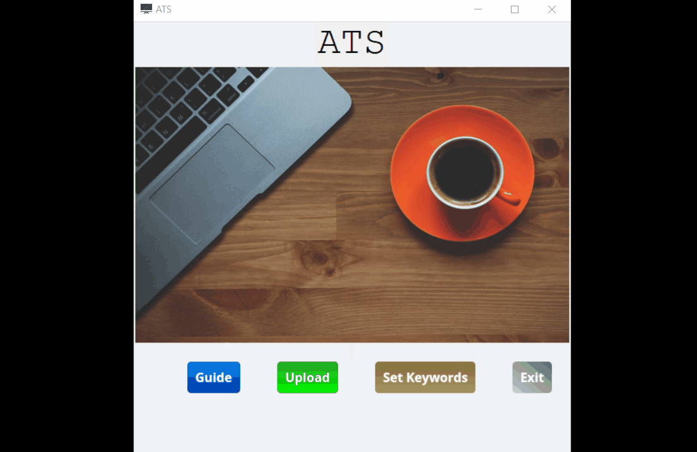

# free_ats

🚧 Project in progress 🚧

A free Applicant Tracking System for recruiters and small company with limited budget.

## How does it work?

- Set the keywords wanted for the next upcoming job
- Upload one/multiple .docx/.pdf resume/s
- Open the excel file generated and get the score, the email and the phone number of each application

## How can I lunch it?

## Credits

[emoji](https://icon-icons.com/icon/mac-screen-monitor-computer/54610): [license cc](https://creativecommons.org/licenses/by/4.0/)

[customize-button](https://www.imagefu.com/create/button)

[Image by Free Photos from Pixabay](https://pixabay.com/photos/cup-of-coffee-laptop-office-macbook-1280537/)
